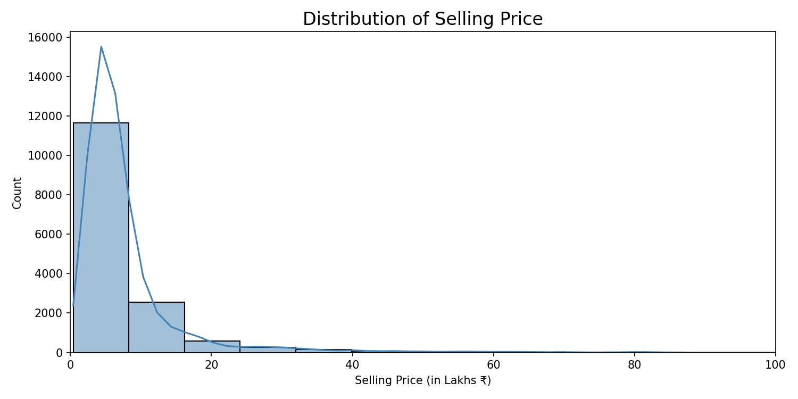
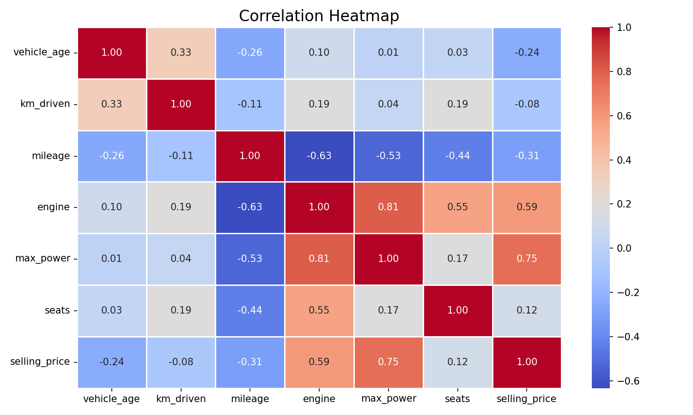
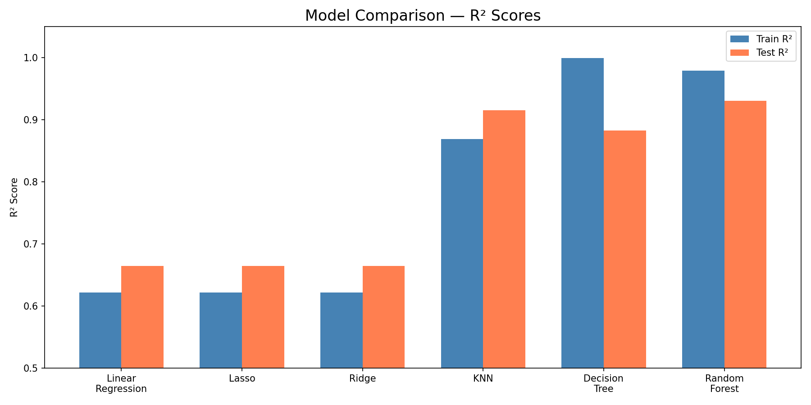

<h1 align="center">🚗 Pre-Owned Vehicle Price Estimation 🚗</h1>
<h3 align="center">With Random Forest Regression</h3>

<p align="center">
  
</p>

<p align="center">
  
  
  
  
</p>

---

## 📌 Project Overview

With thousands of used cars listed on platforms like **CarDekho**, it's difficult for sellers to know the right asking price. Pricing too high means no buyers; pricing too low means losing money.

This project builds a **Random Forest Regression model** that predicts the **resale price of a pre-owned vehicle** based on key features like engine size, max power, mileage, fuel type, and more — giving sellers a data-driven price suggestion based on real market conditions.

---

## 📁 Repository Structure

```
Resale-Car-Price-Prediction/
├── images/
│   ├── selling_price_distribution.png
│   ├── correlation_heatmap.png
│   └── model_comparison.png
│
├── Resale_Car_Prediction.ipynb
├── cardekho_imputated.csv
├── car_price_predictor.pkl
├── preprocessor.pkl
├── .gitignore
└── README.md
```

---

## 🛠️ Libraries Used

- `scikit-learn`
- `pandas`
- `numpy`
- `matplotlib`
- `seaborn`
- `joblib`

---

## 📊 Dataset

The dataset is scraped from [cardekho.com](https://www.cardekho.com)

- **Samples:** 15,411
- **Features:** 13
- **Target Variable:** `selling_price` — resale price in INR

| Feature | Description |
|---|---|
| `model` | Car model name |
| `vehicle_age` | Age of the vehicle (in years) |
| `km_driven` | Total kilometers driven |
| `seller_type` | Individual / Dealer / Trustmark Dealer |
| `fuel_type` | Petrol / Diesel / CNG / LPG |
| `transmission_type` | Manual / Automatic |
| `mileage` | Fuel efficiency (km/l) |
| `engine` | Engine displacement (cc) |
| `max_power` | Maximum power (bhp) |
| `seats` | Number of seats |

---

## ⚙️ Workflow

1. Load the dataset from `cardekho_imputated.csv`
2. Check for missing values — dataset is pre-imputed, no nulls found
3. Drop irrelevant features — `car_name` and `brand` (redundant with `model`)
4. Identify feature types — 7 numerical, 4 categorical
5. Exploratory Data Analysis — price distribution and correlation heatmap
6. Apply **Label Encoding** on `model` column (120 unique values)
7. Train-Test Split — 80% train / 20% test (`random_state=42`)
8. Preprocessing — `OneHotEncoder` for categorical, `StandardScaler` for numerical via `ColumnTransformer`
9. Train and compare 6 models — Linear Regression, Lasso, Ridge, KNN, Decision Tree, Random Forest
10. Hyperparameter tuning using `RandomizedSearchCV` with 100 iterations and 3-fold CV
11. Evaluate using RMSE, MAE, and R² Score
12. Save model and preprocessor using `joblib`

---

## 📈 Exploratory Data Analysis

<p align="center">
  
  &nbsp;
  
</p>

**Key Insights:**
- Most cars are priced between ₹2–15 lakhs — heavily right-skewed distribution
- `max_power` has the strongest positive correlation with selling price (0.75)
- `engine` is the second strongest predictor (0.59)
- `vehicle_age` and `km_driven` show negative correlation with price as expected
- `mileage` negatively correlates with engine size — bigger engines are less fuel efficient

---

## 🤖 Model Comparison

<p align="center">
  
</p>

| Model | Train R² | Test R² |
|---|---|---|
| Linear Regression | 0.6218 | 0.6645 |
| Lasso | 0.6218 | 0.6645 |
| Ridge | 0.6218 | 0.6645 |
| K-Neighbors Regressor | 0.8691 | 0.9150 |
| Decision Tree | 0.9995 | 0.8823 |
| **Random Forest** | **0.9791** | **0.9303** |

Random Forest was selected as the final model — best test R² with no overfitting.

---

## 🔧 Hyperparameter Tuning

```python
rf_params = {
    "max_depth"        : [5, 8, 15, None, 10],
    "max_features"     : [5, 7, "sqrt", 8],
    "min_samples_split": [2, 8, 15, 20],
    "n_estimators"     : [100, 200, 500, 1000]
}
```

Tuning method: `RandomizedSearchCV` — `n_iter=100`, `cv=3`, `n_jobs=-1`

**Best Parameters:**
```python
RandomForestRegressor(
    n_estimators=1000,
    min_samples_split=2,
    max_features=7,
    max_depth=None
)
```

---

## 📉 Final Model Results

| Metric | Train | Test |
|---|---|---|
| R² Score | 0.9804 | 0.9403 |
| RMSE | ₹1,26,209 | ₹2,12,015 |
| MAE | ₹38,890 | ₹98,050 |

---

## 🧪 Sample Prediction

```python
import joblib
import pandas as pd

rf_model = joblib.load('car_price_predictor.pkl')
preprocessor = joblib.load('preprocessor.pkl')

# Sample car — Ford Ecosport
sample = pd.DataFrame([{
    'model'            : 38,        # label encoded value for Ecosport
    'vehicle_age'      : 6,
    'km_driven'        : 30000,
    'seller_type'      : 'Dealer',
    'fuel_type'        : 'Diesel',
    'transmission_type': 'Manual',
    'mileage'          : 22.77,
    'engine'           : 1498,
    'max_power'        : 98.59,
    'seats'            : 5
}])

sample_transformed = preprocessor.transform(sample)
predicted_price = rf_model.predict(sample_transformed)
print(f"Predicted Selling Price: ₹ {predicted_price[0]:,.0f}")
# Output: Predicted Selling Price: ₹ 6,08,500
```

---

## 🚀 How to Run

**1. Clone the repo**
```bash
git clone https://github.com/AnmolPatel20/Resale-Car-Price-Prediction.git
cd Resale-Car-Price-Prediction
```

**2. Install dependencies**
```bash
pip install pandas numpy matplotlib seaborn scikit-learn joblib
```

**3. Run the notebook**
```bash
jupyter notebook Resale_Car_Prediction.ipynb
```

---

## 📌 Notes
- Both `car_price_predictor.pkl` and `preprocessor.pkl` must be loaded together for prediction
- The preprocessor handles all encoding and scaling — never pass raw data directly to the model
- The `model` column requires the label encoded integer value, not the string name

---

## 🙋 About
I'm on my machine learning journey — building, experimenting and documenting as I go. Every notebook here represents something I've genuinely tried to understand, not just run. 🚀

- GitHub: [@AnmolPatel20](https://github.com/AnmolPatel20)
- Portfolio: [anmolpatel20.github.io/Anmol_Portfolio](https://anmolpatel20.github.io/Anmol_Portfolio/)

## 🙏 Acknowledgements
Thanks to **Krish Naik Sir** whose Udemy course has been a great resource throughout this learning journey.

*"Not all those who wander are lost." — J.R.R. Tolkien*

---

<p align="center">⭐ Star this repo if you found it helpful!</p>
